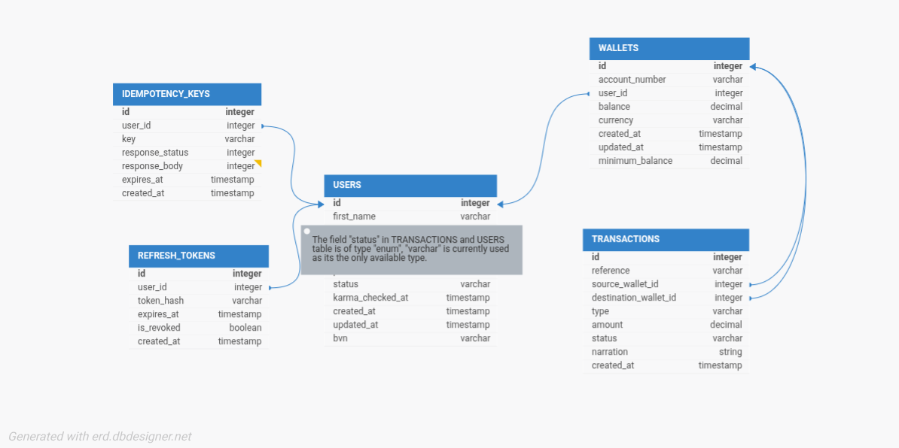

# Pera — Wallet Service

A backend wallet service built to enable lending functionality. Users can create accounts (with a wallet provisioned automatically), fund their wallets, transfer funds to other users, withdraw funds, and view their transaction history.
On signup, the Lendsqr Adjutor Karma blacklist is used to detect past loan defaulters and refuse them getting onboarded.

---

## Table of Contents

- [Tech Stack](#tech-stack)
- [Entity Relationship Diagram](#entity-relationship-diagram)
- [Design Decisions](#design-decisions)
- [Getting Started](#getting-started)
- [Running the App](#running-the-app)
- [Running Tests](#running-tests)
- [API Overview](#api-overview)
- [Known Limitations](#known-limitations)
- [Project Structure](#project-structure)

---

## Tech Stack

| Layer | Technology |
|---|---|
| Runtime | Node.js |
| Language | TypeScript |
| Framework | Express  |
| Database | MySQL |
| Query ORM | Knex.js |
| Authentication | JWT (jsonwebtoken) — access + refresh tokens |
| Validation | Zod |
| Password Hashing | bcryptjs |
| BVN Encryption | AES-256-CBC (Node crypto) |
| Blacklist Check | Lendsqr Adjutor Karma API |
| Rate Limiting | express-rate-limit |
| Testing | Jest  |

---

## Entity Relationship Diagram



> **Relationships:**
> - One `user` has exactly one `wallet` (created atomically during registration)
> - One `wallet` can appear as `source_wallet_id` or `destination_wallet_id` on many `transactions`
> - `source_wallet_id` is `NULL` for fund operations (money coming in from outside)
> - `destination_wallet_id` is `NULL` for withdrawal operations (money going out)
> - One `user` can have many `refresh_tokens` (one per active session)
> - `idempotency_keys` are scoped per user and expire after 24 hours
> - Each `transaction` has two corresponding `ledger_entries` (one debit, one credit) — `ledger_entries.transaction_id` references `transactions.id` with `RESTRICT` on delete to enforce immutability

---

## Design Decisions

### Why MySQL
MySQL is a natural fit for a service handling financial data. It offers multiple benefits like ACID compliance, Data Integrity plus security and regulatory compliance in the industry. The relational model also makes it straightforward to enforce the one-user-one-wallet constraint at the schema level.

### Wallet provisioning at registration
The user insert and wallet insert queries happen inside a single database transaction. Either both succeed or not. This means there is no window where a user exists without a wallet.

### Account numbers instead of email for transfers
Each wallet is assigned a unique 10-digit account number at creation (prefixed with `4`, e.g. `4023819475`). Transfers are identified by `receiver_account_number` rather than email. This mirrors how Nigerian neobanks (Kuda, Opay) operate — email is for identity/auth, account number is for money movement. It avoids exposing PII in transaction requests and is resilient to email changes.

### Row-level locking on transfers
When performing transfers, Knex's `forUpdate()` was used to lock both wallets inside the transaction in ascending `user_id` order no matter who is sending and who is receiving. This means every concurrent transfer grabs locks in the same order, so this eliminates risk of a dead-lock.

The balance check also happens inside the locked transaction — not before it. This means if two transfers try to drain the same wallet at the same time, the second one will see the already-updated balance from the first and correctly reject with insufficient funds, rather than both passing validation on a stale balance read.

### Refresh token rotation
Authentication issues two tokens: a short-lived access token (15 minutes) and a long-lived refresh token (7 days). Refresh tokens are stored as SHA-256 hashes in the database — the raw token is never persisted. On every `/auth/refresh` call, the old token is deleted and a new pair is issued. This means a stolen refresh token can only be used once before it is invalidated. Logout explicitly deletes the token from the database.

### Idempotency keys
Fund, transfer, and withdraw operations require an `Idempotency-Key` header. If the same key is submitted again within 24 hours, the original response is returned without re-executing the operation. This prevents duplicate money movements from network retries. Keys are scoped per user — two different users can send the same key without conflict.

### Zod validation
All request bodies are validated against Zod schemas at the route level before reaching controllers. This means controllers contain zero manual validation logic — they only call the service and return the response. Invalid requests are rejected with a clear error message from the first failed field.

### Karma check returns 404 for clean users
The Adjutor API returns `404` when a BVN is not on the blacklist (not found = not blacklisted). Any other error (network failure, 5xx) is treated as a service outage and returns `503` to the caller rather than silently allowing registration.

### Minimum balance enforcement
Every wallet has a `minimum_balance` of NGN 100 that cannot be spent. Withdrawals and transfers are rejected if the transaction would leave the sender's balance below this floor.

### Double entry ledger
Every financial operation writes two immutable `ledger_entries` records atomically within the same database transaction that mutates balances — one debit and one corresponding credit. For funding, the user wallet is credited and the system float account is debited. For transfers, the sender wallet is debited and the receiver wallet is credited. For withdrawals, the user wallet is debited and the system float is credited. This means the sum of all debits always equals the sum of all credits across the ledger — the books are always balanced. Ledger entries are never updated or deleted, providing a complete and tamper-evident audit trail of all money movement in the system.

### Why Express over NestJS
Express was chosen for its minimal abstraction layer and full control over middleware, routing, and transaction boundaries. For a relatively small, single-service application, this keeps the architecture explicit and avoids unnecessary framework overhead.

### Security considerations
- Passwords are hashed with bcrypt before storage and never returned in any response
- BVN is used for Adjutor API check as each user has only one, as opposed to email or account number which a user can have multiple options
- BVN is encrypted at rest using AES-256-CBC and excluded from all API responses
- Access tokens are short-lived (15 minutes by default). Refresh tokens are long-lived (7 days) but stored as hashes and rotated on every use
- Refresh tokens and access tokens use separate signing secrets (`JWT_SECRET` and `JWT_REFRESH_SECRET`) — this prevents a token of one type being used as the other
- Auth routes are rate-limited to 10 requests per 15 minutes per IP to slow brute-force attempts
- Sensitive fields (`password_hash`, `bvn`, `karma_checked_at`) are removed from user objects when returning data

---

## Getting Started

### Prerequisites

- Node.js >= 18 (Version 24 LTS recommended)
- MySQL >= 8
- pnpm (or npm / yarn)

### Installation

```bash
git clone https://github.com/vector-10/wallet-service-lendsqr.git
cd wallet-service-lendsqr
pnpm install
```

### Environment Variables

Copy the example file and fill in your values:

```bash
cp .env.example .env
```

| Variable | Description |
|---|---|
| `PORT` | Port the server listens on (default: `5000`) |
| `NODE_ENV` | `development` / `test` / `production` |
| `DB_HOST` | MySQL host |
| `DB_PORT` | MySQL port (default: `3306`) |
| `DB_USER` | MySQL user |
| `DB_PASSWORD` | MySQL password |
| `DB_NAME` | Database name (test DB is `<DB_NAME>_test`) |
| `JWT_SECRET` | Secret used to sign access tokens |
| `JWT_EXPIRES_IN` | Access token expiry e.g. `15m` (default: `15m`) |
| `JWT_REFRESH_SECRET` | Secret used to sign refresh tokens (must differ from `JWT_SECRET`) |
| `ADJUTOR_BASE_URL` | Lendsqr Adjutor base URL |
| `ADJUTOR_API_KEY` | Lendsqr Adjutor API key |
| `ENCRYPTION_KEY` | 32-byte hex key for AES-256-CBC BVN encryption |

To generate secure secrets:
```bash
node -e "console.log(require('crypto').randomBytes(64).toString('hex'))"
```

### Database Setup

```bash
# Create the database first, then run migrations
pnpm migrate
```

---

## Running the App

```bash
# Development (with hot reload)
pnpm dev

# Production build
pnpm build
pnpm start
```

Health check:

```bash
curl http://localhost:5000/health
```

---

## Running Tests

```bash
# Run all tests with coverage
pnpm test

# Watch mode
pnpm test:watch
```

Tests use a separate `<DB_NAME>_test` database. All service and route layers are tested against mocked dependencies — no live database or external API calls are made during the test suite.

---

## API Overview

Base URL: `http://localhost:5000/api/v1`

**Authentication**

| Method | Endpoint | Description |
|---|---|---|
| `POST` | `/auth/register` | Register a new user, returns access + refresh token |
| `POST` | `/auth/login` | Login, returns access + refresh token |
| `POST` | `/auth/refresh` | Exchange refresh token for a new token pair |
| `POST` | `/auth/logout` | Revoke refresh token |

**Wallet** — requires `Authorization: Bearer <access_token>`

Financial mutation endpoints (`fund`, `transfer`, `withdraw`) require an `Idempotency-Key` header.

| Method | Endpoint | Description |
|---|---|---|
| `GET` | `/wallet/balance` | Get wallet balance and account number |
| `POST` | `/wallet/fund` | Credit wallet |
| `POST` | `/wallet/transfer` | Transfer to another wallet by account number |
| `POST` | `/wallet/withdraw` | Debit wallet |
| `GET` | `/wallet/transactions` | Transaction history |

Full request/response examples are available in the Postman collection (`postman_collection.json`) included in the repository root.

---

## Known Limitations

- **Funding is simulated** — there is no payment gateway. The fund endpoint credits a wallet directly, representing what would happen after a real provider (Paystack, Flutterwave, etc.) confirms a deposit. In production, funding would be triggered by a webhook from the payment provider, not a direct API call.

---

## Project Structure

```
wallet-service-lendsqr/
├── src/
│   ├── __tests__/              # Unit and integration tests
│   ├── config/
│   │   └── database.ts         # Knex instance, picks env from NODE_ENV
│   ├── controllers/            # Parse request, call service, send response
│   │   ├── token.controller.ts # Refresh and logout handlers
│   │   ├── user.controller.ts
│   │   └── wallet.controller.ts
│   ├── middlewares/
│   │   ├── auth.ts             # JWT verification
│   │   ├── errorHandler.ts     # Global Express error handler
│   │   ├── idempotency.ts      # Idempotency key enforcement
│   │   ├── rateLimiter.ts      # IP-based rate limiter for auth routes
│   │   └── validate.ts         # Zod schema validation middleware
│   ├── migrations/             # Knex schema migrations (users, wallets, transactions, refresh_tokens, idempotency_keys, ledger_entries)
│   ├── routes/                 # Express routers
│   ├── services/               # Business logic
│   │   ├── adjutor.service.ts  # Lendsqr Karma blacklist check
│   │   ├── token.service.ts    # Refresh token storage and rotation
│   │   ├── user.service.ts     # Registration, login, BVN encryption
│   │   └── wallet.service.ts   # Fund, transfer, withdraw, history
│   ├── types/                  # Shared TypeScript interfaces and types
│   ├── utils/
│   │   ├── accountNumber.ts    # 10-digit account number generator
│   │   ├── asyncHandler.ts     # Wraps async controllers, catches errors
│   │   ├── encryption.ts       # AES-256-CBC encrypt for BVN
│   │   ├── errors.ts           # Custom AppError subclasses with HTTP codes
│   │   ├── reference.ts        # UUID-based transaction reference generator
│   │   ├── response.ts         # sendSuccess / sendError helpers
│   │   ├── token.ts            # JWT sign and verify (access + refresh)
│   │   └── validateEnv.ts      # Fail-fast check for required env vars
│   ├── validators/
│   │   ├── auth.validator.ts   # Zod schemas for register, login, refresh
│   │   └── wallet.validator.ts # Zod schemas for fund, transfer, withdraw
│   ├── app.ts                  # Express app setup
│   └── server.ts               # HTTP server entry point
├── .env.example
├── jest.config.js
├── knexfile.ts
└── tsconfig.json
```

---

## License

ISC
